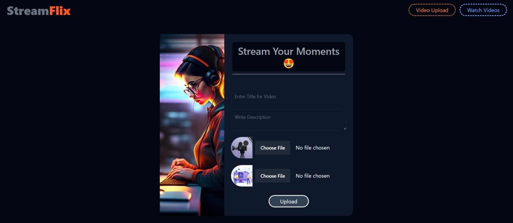
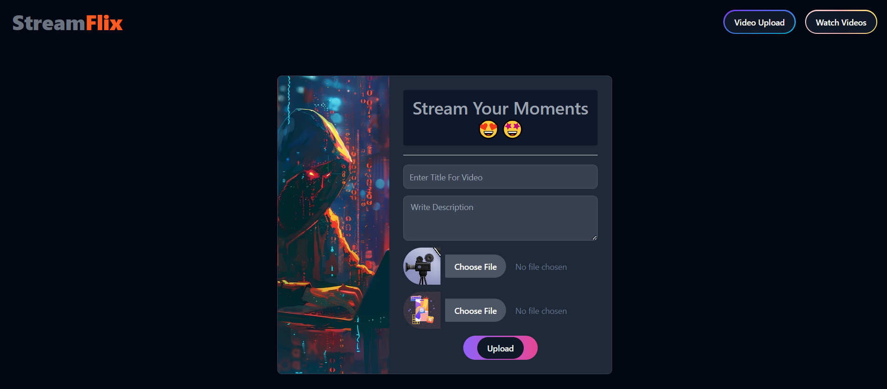
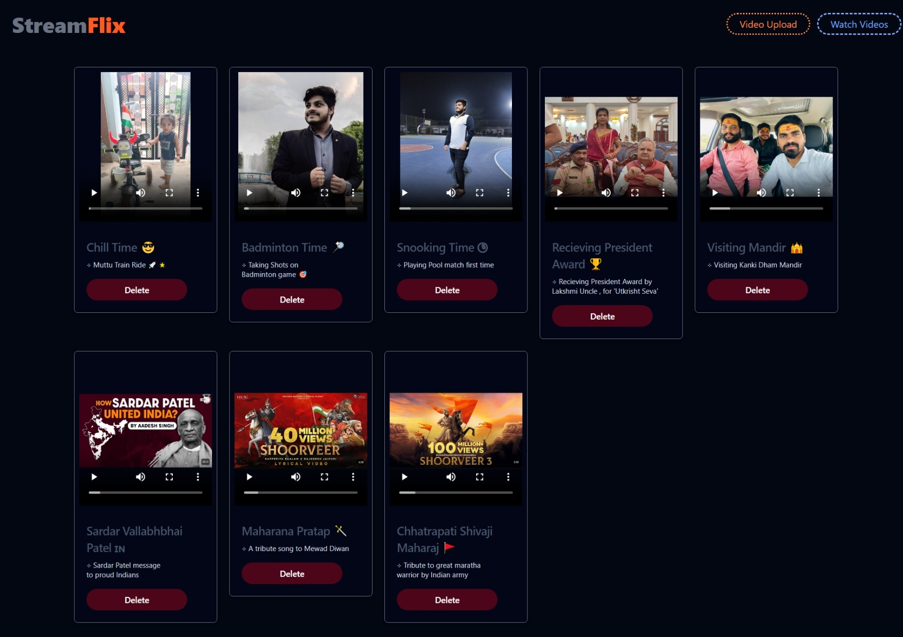

# :: STREAM FLIX :: 

- [Live Preview](https://streamflix-unhp.onrender.com)
- [CodeTime  Insights](https://wakatime.com/@Er_Jrsingh/projects/afhxugyxnk)

> > Developed a video streaming application with adaptive bitrate streaming using
> > HLS (HTTP Live Streaming). Implemented video playback in multiple resolutions,
> > ensuring seamless viewing experiences across devices.

> ### Learnings -

- Java, Angular, React, JavaScript, Spring boot, MySql, API
- Vite, Axios, Flowbite
- Video.js, Hls.js
- Cookie Management
- FFmpeg for Transcoding
- Byte range for buffering optimization
- Video Download Prevention Mechanism
- Importance of resource closing
- Importance of e.printStackTrace()
- Http Headers
- Power of Web Services with Multipart File
- pgBouncer Prepared Statement Error resolution using prepareThreshold=0

> ### Endpoints -

- POST - /api/v1/videos
- GET - /api/v1/videos/stream/
- GET - /api/v1/videos/stream/{videoId}
- GET - /api/v1/videos/stream/range/{vidId}
- GET - /api/v1/videos/stream/thumb/{videoId}
- GET - /api/v1/videos/stream/{videoId}/master.m3u8
- GET - /api/v1/videos/stream/{vidId}/{segment}.ts
- GET - /api/v1/videos/stream/delete/{vidId}
- GET - /api/v1/videos/stream/delete/all
- GET - /api/v1/visitor/save
- GET - /api/v1/visitor/save/all
- GET - /api/v1/visitor/save/{ip}
- GET - /api/v1/visitor/get/{ip}
- GET - /api/v1/visitor/all
- GET - /api/v1/visitor/delete/{ip}
- GET - /api/v1/visitor/delete/all

> ### Snaps -

> > 
>
> > 

> > 